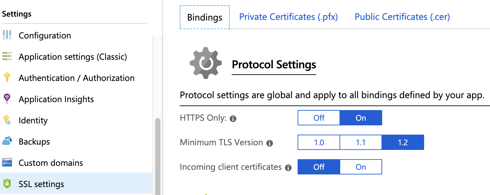

# Module 1: Getting Started - Passwordless Workshop Prerequisites and Setup
This section outlines the prerequisites to complete the workshop and instructions for setting up the development environment that you will use throughout the workshop.

## Prerequisites
In order to complete this workshop you will need a development environment with the following:
* [Git](https://git-scm.com/)
* [JDK 1.8](https://www.oracle.com/technetwork/java/javase/downloads/index.html) or later
* [Maven 3.2](https://maven.apache.org/download.cgi)+
* FIDO2 compatible platform / browser
  * MacOS: [Safari Technical Preview](https://developer.apple.com/safari/technology-preview/) version 71+
  * Windows 10 Version 1809+: Edge, Chrome version 72+, Firefox version 66+
* A favorite text editor or IDE
* A security key

This workshop can either be completed locally or in the cloud. Instructions for running in the [Azure Cloud Shell](https://docs.microsoft.com/en-us/azure/cloud-shell/overview) are included. If you already have a subscription you can use it or you can get a free trial [here](https://azure.microsoft.com/free/). If you prefer a different cloud development environment, feel free to use it instead.

### Launch Azure Cloud Shell
_Skip this step if you are using a local dev environment._

<details>
<summary><strong>Step-by-step instructions launch Azure Cloud Shell</strong></summary><p>

Please make sure not to use a production Azure environment or account for this workshop. It is recommended to instead use a development account which provides full access to the necessary services so that you do not run into permissions issues.

The Azure account may accrue charges. Be sure to clean up when you are done to prevent the accrual of additional charges.

Try from shell.azure.com by clicking below.


Try from [Azure portal](https://portal.azure.com) using the Cloud Shell icon.


</p></details>

### Download Workshop Code
Clone the workshop repository.

```
git clone https://github.com/elukewalker/PasswordlessWorkshop
```

### Set the Active Spring Profile
1. Go to the resources folder
   ```
   cd PasswordlessWorkshop/initial/src/main/resources
   ```
2. Open application.properties with your preferred editor and set the spring.profile.active to 'cloud' for cloud development or 'local' to configure the local server for SSL. _Note: Azure Cloud Shell has an [Integrated Cloud Shell Editor](https://docs.microsoft.com/en-us/azure/cloud-shell/using-cloud-shell-editor). Just run ```code .```_
   ```
   spring.profiles.active=cloud
   ```

### Generate Self-Signed Certificate for SSL
_Skip this step if you are using a cloud dev environment._

WebAuthn requires https so you will need to generate a self-signed certificate if running locally. 

<details>
<summary><strong>Step-by-step instructions (expand if running locally)</strong></summary><p>

1. Navigate to the keystore directory.
   ```
   cd keystore
   ```
2. Create a set of cryptographic keys and store it in the PKCS12 keystore format.
    ```
    keytool -genkeypair -alias demo -keyalg RSA -keysize 2048 -storetype PKCS12 -keystore demo.p12 -validity 3650

    ```
3. Update the server ssl keystore password. Go up one directory to the resources folder and find the application-local.properties file.. Open it with your preferred editor and replace the server.ssl.key-store-password with the one used in the previous step.
   ```
   server.port=8443
   server.ssl.key-store-type=PKCS12
   server.ssl.key-store=classpath:keystore/demo.p12
   server.ssl.key-store-password=changeit
   server.ssl.key-alias=demo

   security.require-ssl=true
   ```
</p></details>

### Validate Web App is Working
#### Run Web App Locally
1. In the initial folder run
   ```
   mvn clean package spring-boot:run
   ```
2. Once the application starts up, point your browser to https://localhost:8443. You should see the home page.

_Note: In Safari, you may need to open https://localhost:8443 in a private window._

#### Run Web App on Azure App Service
1. Open the ```pom.xml``` in an editor
2. Configure the [Maven Plugin for Azure App Service](https://docs.microsoft.com/en-us/java/azure/spring-framework/deploy-spring-boot-java-app-with-maven-plugin?view=azure-java-stable). Update the following placeholders in the plugin configuration:
    ```
    <resourceGroup>${RESOURCEGROUP_NAME}</resourceGroup> <!--e.g. PasswordlessWorkshop -->
	<appName>${WEBAPP_NAME}</appName> <!--e.g. MyPasswordlessWebApp -->
	<region>${REGION}</region> <!--e.g. centralus -->
    ```
3. Deploy the app to Azure
   1. Configure
   ```
   mvn clean package azure-webapp:config
   ```
   1. Build and deploy
   ```
   mvn clean package azure-webapp:deploy
   ```
   Maven will deploy your web app to Azure; if the web app or web app plan does not already exist, it will be created for you.
4. Set HTTPS Only in SSL Settings
   1. Go to the web app listed in App Service
   2. Open SSL settings and set HTTP Only to On
   
5. Go to the Overview and click the URL. You should see the home page.

## Recap
* Use a unique personal or development Azure account that will not interfere with production systems
* Use a single, consistent region throughout this workshop if in a cloud dev environment
* Keep your Azure Cloud Shell opened in a tab at all times

## Next
Once you have your development environment fully working, proceed to the next step in the workshop - [Credential Repository](../2_Credential_Repository/README.md)